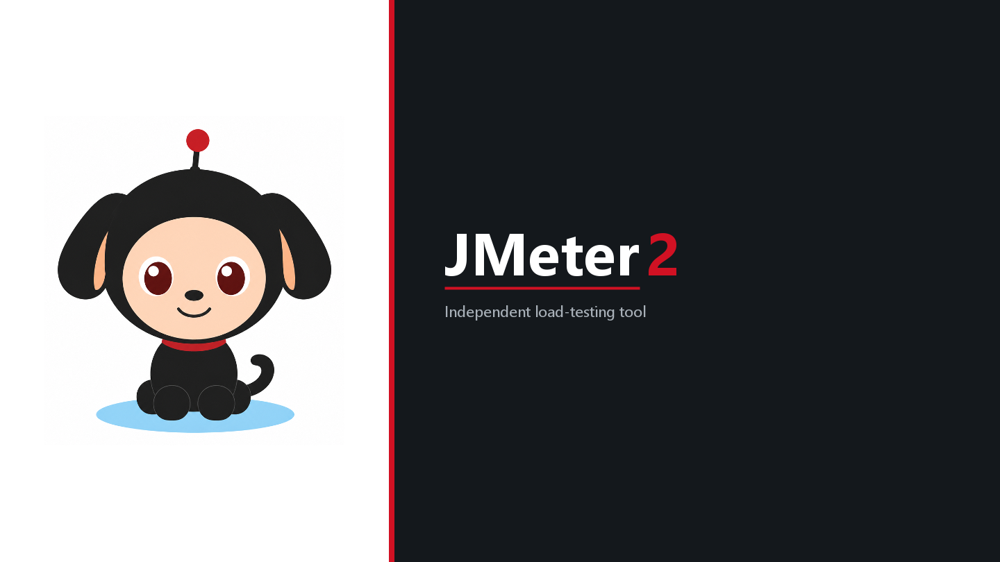

# JMeter2

<p align="center">
  
</p>

**JMeter2 is an independent fork. It is not an Apache Software Foundation release and is not affiliated with Apache JMeter.**

Based on [Apache JMeter](https://jmeter.apache.org/) 5.6.3 (Apache License 2.0).  
Current version: **1.0.0**

JMeter2 是基于 Apache JMeter 5.6.3 的独立开源 fork，**不是** Apache 官方发行版。相对上游，主要打磨了中文使用体验、界面易用性和部分兼容性问题。使用本项目遇到问题请在 **本仓库** 提 Issue，请不要报到 Apache JMeter 的 JIRA 或邮件列表。

官方项目：https://jmeter.apache.org/

## 相对上游改了什么

详见 [CHANGELOG.md](CHANGELOG.md)。摘要：

- 中文界面（默认 `zh_CN`）、HTML 报告中英切换
- HTTP 请求 **消息体数据** 可直接查找 / 定位 / 替换（不必用结构树搜索）
- 异步写 `.jtl`、大报告生成更稳
- 可选 HttpClient5 采样器
- 发行包名 `jmeter2-<version>`，入口只有 `jmeter2.bat` / `jmeter2.sh`

## 消息体查找 / 替换

打开 HTTP 请求，切到 **消息体数据**。正文上方有查找栏，只作用于当前消息体，和左侧结构树搜索无关。

1. 在 **查找** 框输入内容，点 **下一个** / **上一个**（或回车）定位并选中  
2. 在 **替换为** 框输入新内容，点 **替换**（当前这一处）或 **全部替换**  
3. 可选：区分大小写、正则表达式  

光标在消息体里时：**Ctrl+F** 跳到查找框，**F3** / **Shift+F3** 下一处 / 上一处。

## 运行

本仓库是 **源码**。可运行的工具包在 [Releases](https://github.com/c01djc/jmeter2/releases)，不要在源码目录里找安装包。

需要 **Java 8+**（录制 HTTPS 建议用带 `keytool` 的 JDK）。

1. 打开 [Releases](https://github.com/c01djc/jmeter2/releases)，下载 `jmeter2-1.0.0.zip` 并解压  
2. 进入 `jmeter2-1.0.0/bin`  
3. Windows 运行 `jmeter2.bat`，Linux / macOS 运行 `./jmeter2.sh`

无界面压测并出 HTML 报告：`jmeter2-report.bat` / `jmeter2-report.sh`。

路径里不要有空格。

## 从源码打包

构建需要 **JDK 17**（运行仍可用 Java 8）。

```bat
gradlew :src:dist:distZip -PchecksumIgnore -Prelease
```

产物：`src/dist/build/distributions/jmeter2-1.0.0.zip`

更多 Gradle 命令见 [gradle.md](gradle.md)。

## 反馈

- 本 fork 的问题 / 改进：本仓库 GitHub Issues  
- 上游 Apache JMeter：https://jmeter.apache.org/issues.html  

## 许可

沿用 [Apache License 2.0](LICENSE)。请保留 `LICENSE` 与 `NOTICE`。  
Java 包名仍为 `org.apache.jmeter`，以便兼容现有插件。
